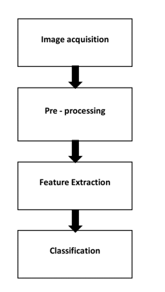

# American Sign Language Gesture Recognition by Computer Camera

## System specification

In almost computer vision method, the input device is the images of hands or fingers. This methods require only a camera without the use of any extra devices. These systems extracted the biological characteristic by describing artificial vision systems that are implemented in software and/or hardware. This approach created a challenging problem as these systems need to be background invariant, lighting insensitive, person and camera independent to achieve real time performance. Moreover, such systems have to be enhanced to addapt to requirements, including accuracy and robustness.

Block Diagram of vision based recognition system 

Almost vision method is based on the way human get information in their environment but it is not easy to perform it in devices. a lot of different approaches have been verified so far. One of them is to build a three dimensional model of the human gesture. The system is compared with images of the gesture by one or more cameras, and parameters responses to palm direction and joint angles are estimated. Gesture classification is created by these parameters. Second one to get the picture using a camera then extract some feature and those features are input in a classification algorithm for classification.

## Algorithms

### Use case diagram.

Use Case Diagram for Sign Language Recognition Using Hand Gestures.

In our model, the users have 3 abilities: adding gestures, regconizing gestures and observing or equalizing manual parameters of training models. Users can create the gestures added our model through the user display. After that, the information will be trained the system by CNN [5].

### Module in the system.

Data Pre-Processing – In this application, based on the object detected in front of the camera its binary pictures is being common. The key object will be overlayed with solid white and background will be overlayed with solid black. Based on the pixel’s regions, their numerical value in range of either 0 or 1 is being given to next process for modules.

Scan Single Gesture – A gesture scanner will be performed in front of the end user where the user will have to perform a sign language gesture. Based on Pre-Processed module output, a user shall be able to see associated label assigned for each hand gestures, based on the predefined American Sign Language (ASL) standard inside the output window screen [10].

Create gesture – A user will give an expected gesture as an input to the method with the text box at the bottom of the display. These customize gestures will then be saved for future aims and will be found in the next time.

Formation of a sentence – A user can choose a delimiter and until that delimiter is added every scanner gesture character will be inserted with the previous outcome forming a stream of meaningful words and sentences.

Exporting – A user can export the outputs of the scanner character into an textual file format.

###	Training process

To build the data set as a model and training we choose Vietnamese sign language. We opted out of the Ho Chi Minh Sign Language Dictionary for 12 words of sign language[9]. Each word in the archive is recorded with a total of about 2200 samples. These gestures are captured using the camera. 

Fig. 5. Some word of the training model.

After that, the best 2000 samples were selected. All of these images are extracted from the full animation of gestures, from the first frame to the last frame. The recorded sample will be processed to remove the background and keep the hand grayscale image.

For more detail, we restricted an area of the image captured by the camera, cut out that part and processed the color through the OpenVC library with “cvtColor” and “bitwise_and”.

To start, we learn the training principle and we choose to convert a gesture sequence into multiple split frames and learn them in an orderly manner. Learning the frames broken down from an action will help maximize the machine's processing / learning capabilities and to learn these frames we choose the CNN [5] training method through Keras [4].

To decrease the amount of parameters we only need to learn the weights of the filter (which usually is a lot smaller than the input image) instead of learning the weights connecting each input pixel.

CNN method [5]  is one of advanced deep learning paradigms. Especially, CNN [5]  is widely used for solving object detection of images. The CNN [5] is divided into 3 dimensions: wide, high and deep. In the network, the neurons are not fully connected to the entire next neuron but they still have a relationship. Thus, an output layer is minimized to the vectors in those 3 dimensions.

Cnn_model.py will train our data. Here are 4 steps pre-train (create a completed CNN).

Step 1. Initialing sequentially the images, it’s encoded by classifier.add and Convolution2D with 2 values 0 (black) and 1 (white) into the size 64×64×3, convolution mean every element is multiplied with the matrix 3×3 and sum up into 1 cell in new matrix that we call convolved feature. The convolved feature has the size 64×3×32. The neurons from the Neural Network chapter remain unchanged: They still compute a dot product of their weights with the input followed by a non-linearity, but their connectivity is now restricted to be local spatially. Finally, we have 3 convitional layers with the recognition feature.

Step 2. Here we use Maxpooling method with Maxpolling2D. The pooling layer is used right after the convulational layer to simplify output information to reduce the number of neurons. The pooling procedure is applied as max-pooling, which selects the maximum value in the 2×2 input area. Thus, through the Max Pooling layer, the number of neurons is halved. So every time we add a convolution layer, we apply maxpooling. In this model, we use a total of 3 convitional layers.

Step 3. Before fully connect among layers, we flat them with classfier.add(flatten())

Step 4. Finally, we put all the layers together into a completely CNN [5]. 2 final layer is a fully connected layer. This layer connect every neuron from max-pooled layer to every output neuron. At this point, we have a CNN [5]  used for training.

Fig. 6. Deep learning architecture of CNN in the context of transportation.

After creating a CNN [5], we jump to training part with compile() method.

Step 1. We specify the training configuration (optimizer, loss, metrics) by classifier.compile

Step 2. We call fit(), which will train the model by slicing the data into "batches" of size "batch_size", and repeatedly iterating over the entire dataset for a given number of "epochs". The Keras library [4] will help retraining our CNN [5]. At this point, we have a completely trained model.

All the models we trained are converted by classifier.save into h5py file (VSLModel.h5) which is a lot lighter than the number of frames input that we put in, just encapsulated in one model file.

### Recognition of Real-time camera.

The problem when we compare real time is that we need to compare data sources, so we use deep learning to do that. As we mentioned the above image processing method, we also use it for handling the input gestures. We use OpenCV for the webcam recognition. The input gestures are converted into grayscale mode.

Fig. 8. Single word detected in real-time.

At this point, we exploit the comparison method of Keras (Tensorflow framework) [4] which can connect with trained data. Our real-time input has size of 64×64, we used img_to_array to encode it into matrix of 0 and 1 and into vectors then we start to compare with our trained model (VSLModel.h5) by classifier.predict. With the accuracy accepted, the result text is appeared in the screen. However, we set up the gap among words based on the delay of our input gestures. For example, if we don’t make any operation or we halt our action for a moment, the program understand it as a delay and the output will be an underscore. The resting frame we set here is 20. We also make a create gestures option which can allow to create your own words but only with low accuracy (1 image to compare) in 1 session.

Our last part is to make an application that everyone can use easily so we use PyQt5 to design a Graphic User Interface.

Finally, we execute our project with Pyinstaller. Furthermore, we pack it to 1 file installation which people can use it easily even without installing Python.

## Experimental result

For single gesture tested, we received high accuracy result. Therefore, it is supposed to say that the trained data has worked properly. This is real-time testing, with the latancy less than 0.5s.  However, the brightless afftected a lot in the results since we must convert real-time gestures into grayscale. Furthermore, our project has a limitation which can allow the gestures with the clean background only. If we have a complicated background, for example, our body, the real-time input is disturbed.

For the training accuracy test, we captured 200 frames of a real-time gesture and start to test the accuracy compare with data trained, the accuracy oscillate between 99% and 100%, which can show that our training method has a very high accuracy. Our model is focusing a lot of attention on training data and does not bring generality on never-before-seen data. This leads to the model achieving extremely good results on the training data set

 
Fig. 9. Training accuracy plot using matplotlib library.

In manual testing, we perform 10 gestures in 200 times and record the obtained results and calculate to percentage accuracy, the accuracy oscillate between 97% and 99.5%. This test is performed on only one camera, the actual accuracy may vary with poor camera quality.

Fig. 10. “I am boring” recognition

Overall, the application works in real-time smoothly and acceptable. However, we are doing with the low trained data. With the increase of trained data, the accuracy is changed. We will work more to handle all the existed problems. Thus, we will try to go a step further with the addition of background and background filtering.

